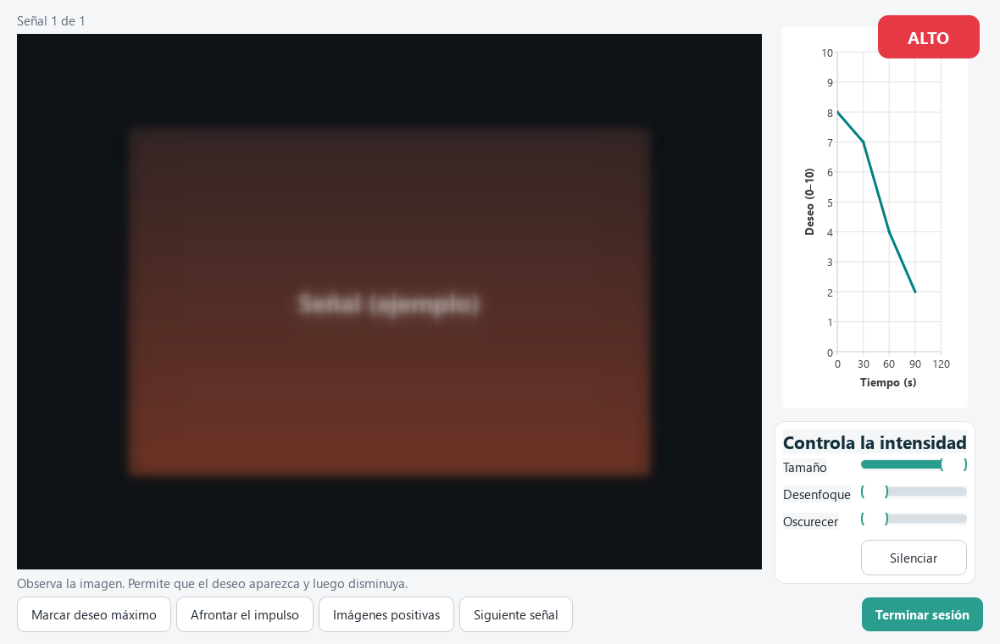

# CETUS

**Cue Exposure Therapy (CET) with Urge-Specific Coping Skills — a non-VR, clinician-supervised desktop app.**

CETUS presents personalized substance cues (images, video, sound for alcohol,
tobacco, methamphetamine, and clinic-defined custom substances) in a controlled,
supervised session to **induce and then habituate craving**, paired with the four
evidence-based urge-specific coping skills (USCS) and CBT. Bilingual UI (Spanish default,
English — [drop-in for more](docs/LOCALIZATION.md)), local-only data, built with Python + PySide6.



> ⚠️ **Clinical disclaimer.** CETUS is an **adjunct** to therapy, for use **under
> professional supervision**. It is **not** a medical device, **not** a standalone
> treatment, and makes **no** claim of clinical efficacy. The evidence base for non-VR
> digital CET is mixed-to-null in rigorous RCTs (e.g. Mellentin 2019). Deliberately
> exposing a patient to drug cues can trigger craving and carries relapse risk — always
> obtain consent, keep the patient supervised, and have a safety plan. The always-visible
> **ALTO** (STOP) button and configurable crisis contacts are mandatory safety features.
> See [`docs/DISCLAIMER.md`](docs/DISCLAIMER.md).

---

## Features

- **Graded, personalized cue exposure** — images/video/sound ordered by appetitive
  intensity; optional randomized order; ← → to change cues; loop mode.
- **Patient-controlled intensity** — shrink, blur, dim, mute the cue (keyboard:
  `T`/`D`/`O`/`M`, `R` reset) so the patient down-regulates exposure themselves.
- **Craving VAS (0–10)** at baseline/peak/endpoint + periodic, with a live habituation
  curve; configurable habituation criterion.
- **Guided USCS/CBT coping** (name the feeling → recall a consequence → recall a benefit
  → choose an alternative) and an on-demand **positive counter-stimuli gallery**.
- **Ambient sound bed** layered under the visual cue (boosts presence).
- **Always-on ALTO panic button** (Esc) → calm screen with therapist/crisis numbers.
- **Fullscreen / kiosk mode** — `F11` toggles fullscreen for distraction-free sessions.
- **Multi-patient clinician dashboard** with local login, pseudonymous patient codes,
  per-patient cue configuration, custom substances, and an in-app admin recovery.
- **Clinical reports** — per-session detail (annotated curve, evidence-based metrics,
  per-cue reactivity, coping responses, clinician notes) and cross-session progress;
  export to **CSV** and **landscape PDF** with optional clinic logo and a comments toggle.
- **In-app Help** (F1) documenting every feature and its scientific basis with citations.
- **Bilingual UI** — Spanish (default) and English, switchable live from the login screen and
  Settings (persisted, no restart). Adding a language is a drop-in JSON file — see
  [`docs/LOCALIZATION.md`](docs/LOCALIZATION.md).

See more screenshots in [`docs/screenshots/`](docs/screenshots/).

---

## Quick start (run from source — any OS)

Requires **Python 3.11+**. Works on Windows, macOS, and Linux.

```bash
git clone <your-repo-url> CETUS
cd CETUS
python -m venv .venv
# Windows:  .\.venv\Scripts\activate     macOS/Linux:  source .venv/bin/activate
pip install -r requirements.txt
python run.py
```

First launch prompts you to create a clinician account, then: add a patient →
*Configurar señales* (a small Creative-Commons sample set ships in `media/`) →
*Iniciar sesión de exposición*.

---

## Building a standalone binary

PyInstaller produces a **per-OS** binary (it cannot cross-compile), so build on the OS
you want to ship for. One-file, no Python required on the target machine.

```bash
# Windows
./build.ps1            # -> dist\CETUS.exe

# macOS / Linux
./build.sh            # -> dist/CETUS
```

Both scripts create the venv, install dev deps, run the test suite, then build via the
committed `cravingcrave.spec`.

### Distribution layout
Ship the binary next to an external `media/` folder (and let it create `data/` on first
run):

```
CETUS/            # what you hand to the clinic
├── CETUS(.exe)   # the built binary  (see GitHub Releases)
├── media/               # cue library (drop in patient-specific cues)
└── data/                # created on first run; local SQLite DB (PII — keep private)
```

**Binaries are distributed via [GitHub Releases](../../releases), not in the git repo**
(the one-file build is ~200 MB, over GitHub's file limit).

---

## Content tooling (optional, offline — never imported by the app)

Scripts in [`tools/`](tools/) populate the cue library from openly-licensed sources.
They have their own deps (`tools/tools_requirements.txt`) and are never part of the
shipped app.

```bash
python tools/fetch_open_access.py     --query "puppy"            --category positive --count 10
python tools/fetch_wikimedia_video.py --query "beer pouring"     --category alcohol  --count 2
python tools/fetch_freesound.py       --query "bar ambience"     --count 4            # needs FREESOUND_API_KEY
python tools/generate_gemini.py       --prompt "calm forest"     --category positive  # needs GEMINI_API_KEY
```

Use only Creative-Commons / owned media; re-encode video to **H.264 + AAC mp4**. Each
tool logs attribution to a `_licenses.csv`. Review all media for clinical appropriateness.

---

## Tests

```bash
pytest                       # ~70 unit/integration + offscreen GUI tests
python scripts/functional_test.py    # end-to-end harness (PASS/FAIL report)
```

---

## Project layout

```
cravingcrave/
  domain/     pure clinical rules + models (habituation, vas, playlist, uscs, reports)  — no Qt
  data/       sqlite3 + repositories + migrations
  services/   i18n, auth, media discovery, crisis info, substances, help, CSV export
  session/    SessionController (orchestration) + state machine
  ui/         PySide6 screens + widgets (cue_view = the scale/blur/dim/mute surface)
  resources/  i18n/es.json, help/es.json, styles, icons
tools/        offline content acquisition (not imported by the app)
scripts/      developer/QA helpers (functional test, screenshots, grading, samples)
tests/        domain / data / ui (pytest, pytest-qt)
```

`domain/` and `session/` import no Qt, so the clinically meaningful logic is unit-tested
without a GUI.

---

## Scientific basis & behavioral mechanisms

CETUS is a theory-grounded **adjunct**, not a proven standalone treatment — CET effects
are **small, mixed, and debated**. See **[`docs/MECHANISMS.md`](docs/MECHANISMS.md)** for a
thorough, cited explanation of the six mechanisms each feature targets (Pavlovian cue
reactivity, extinction/within-session habituation, spontaneous recovery, affect modulation,
urge-specific coping, mechanistic monitoring) and an honest efficacy summary.

Key references (report metrics are descriptive/exploratory — small n, no statistical inference):

- Cue-reactivity foundation — Carter & Tiffany 1999 (*Addiction*, PMID 10605857)
- CET efficacy meta-analysis (small–medium, GRADE low) — Kiyak et al. 2022
  ([10.1016/j.addbeh.2022.107578](https://doi.org/10.1016/j.addbeh.2022.107578))
- Mean craving during exposure predicts abstinence — Schröder et al. 2024
  ([10.1038/s41598-024-58168-7](https://doi.org/10.1038/s41598-024-58168-7))
- Cue reactivity (peak − baseline) — Lütt et al. 2026
  ([10.2196/84156](https://doi.org/10.2196/84156))
- Within-session habituation until criterion — Powell, Gray & Bradley 1993
  ([10.1111/j.2044-8260.1993.tb01026.x](https://doi.org/10.1111/j.2044-8260.1993.tb01026.x))
- Between-session spontaneous recovery — Price et al. 2010
  ([10.1016/j.brat.2010.05.010](https://doi.org/10.1016/j.brat.2010.05.010))
- Affect × craving — Heckman et al. 2013 ([10.1111/add.12284](https://doi.org/10.1111/add.12284))
- CET-USCS protocol/app — Mellentin et al. 2017/2019
  ([10.2196/13793](https://doi.org/10.2196/13793)); Monti & Rohsenow 1999

*References retrieved from PubMed.*

---

## License

Source code: **MIT** — see [`LICENSE`](LICENSE). Bundled media keep their own licenses
(see each `media/*/_SAMPLES.csv`). Not a medical device; no warranty of clinical efficacy.

See [`docs/CHANGELOG.md`](docs/CHANGELOG.md) for version history.
