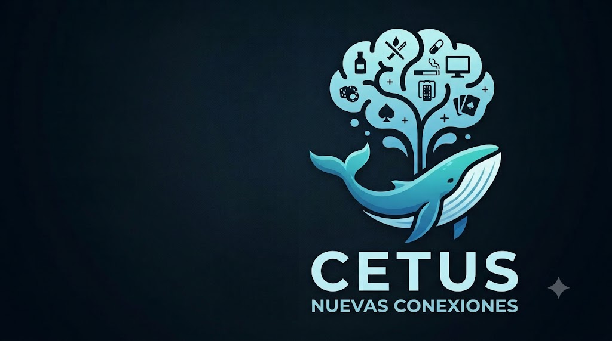

<p align="center">
  
</p>

# CETUS

**Cue Exposure Therapy (CET) with Urge-Specific Coping Skills — a non-VR, clinician-supervised desktop app.**

CETUS presents personalized substance cues (images, video, sound for alcohol,
tobacco, methamphetamine, and clinic-defined custom substances) in a controlled,
supervised session to **induce and then habituate craving**, paired with the four
evidence-based urge-specific coping skills (USCS) and CBT. Bilingual UI (Spanish default,
English — [drop-in for more](docs/LOCALIZATION.md)), local-only data, built with Python + PySide6.


> ⚠️ **Clinical disclaimer.** CETUS is an **adjunct** to therapy, for use **under
> professional supervision**. It is **not** a medical device, **not** a standalone
> treatment, and makes **no** claim of clinical efficacy. The evidence base for non-VR
> digital CET is mixed-to-null in rigorous RCTs (e.g. Mellentin 2019). Deliberately
> exposing a patient to drug cues can trigger craving and carries relapse risk — always
> obtain consent, keep the patient supervised, and have a safety plan. The always-visible
> **ALTO** (STOP) button and configurable crisis contacts are mandatory safety features.
> See [`docs/DISCLAIMER.md`](docs/DISCLAIMER.md).

---

## What's new in 0.9.11

- **Three session modes** — *Intense Craving Evocation*, *Interspersed Neutral Stimuli*
  (craving cues mixed with neutral controls), and *Custom*. Each mode has its own playlist
  builder and VAS timing rules.
- **VAS display alternatives** — Slider (default), Circles (progressive sizes), and Stars
  (gold star rating), switchable in Settings.
- **Import Images from Web wizard** — a guided 6-page wizard with Pexels API integration,
  thumbnail search, SHA-256 dedup, and a substance-cue teaching page. Auto-launches on
  first run.
- **Weighted cue databases** — ships with MOCIS (360 meth/opioid/neutral) and PLSC
  (tobacco/neutral) empirically validated craving ratings. Weights serve as Bayesian priors
  for adaptive cue ranking.
- **Auto-update weights from session data** — after each session, Bayesian-shrunk reactivity
  scores are written back to `craving_weight`. Configurable: patient-only or cross-patient
  population source, minimum sessions before overwrite, and a one-click reset to research
  values.
- **Patient Setup Wizard** — evidence-based session recommendations with 16 PubMed
  citations, mode suggestion based on patient profile.
- **Media dedup scanning** — SHA-256 scan across all media folders (in the wizard + periodic
  background check every 40 launches).
- **Responsive UI** across resolutions — compact/normal/wide screen detection with adaptive
  margins, dialog sizes, and minimum window dimensions.
- **Video improvements** — pause/resume during VAS overlays, video-aware VAS deferral (wait
  for first full loop), configurable loop + max exposure time.
- **Progressive down-regulation** now uses craving-cue-only time (neutral cues don't advance
  the regulation timer).

Earlier: **adaptive cue ordering** (0.7.0), key-gated **Admin Center** with backup/restore,
patient data handling, clinician management, cohort reports (0.6.0), five **themes** (0.6.0),
and **keyboard accessibility** with remappable shortcuts (0.4.0). See
[`docs/CHANGELOG.md`](docs/CHANGELOG.md) for the full history.

---

## Features

### Exposure & session modes
- **Graded, personalized cue exposure** — images/video/sound ordered by appetitive
  intensity; optional randomized order; ← → to change cues; loop mode.
- **Three session modes** — *Intense Craving Evocation* (all craving cues, graded),
  *Interspersed Neutral Stimuli* (craving cues mixed with neutral controls, last-third rule),
  and *Custom* (clinician-configured). Default mode configurable in Settings.
- **Patient-controlled intensity** — shrink, blur, dim, mute the cue (keyboard:
  `T`/`D`/`O`/`M`, `R` reset) so the patient down-regulates exposure themselves.
- **Progressive down-regulation (experimental)** — gradually applies a regulation floor
  over craving-cue time (neutral cues don't count). Linear or stepped mode.
- **Dynamic neutral increase** — inserts extra neutral cues until craving drops below a
  configurable threshold.
- **Video improvements** — configurable loop (default: loop indefinitely), pause/resume
  during VAS overlays, video-aware VAS deferral (wait for first full loop before prompting),
  and min/max cue exposure time with a discrete countdown hint.

### Craving measurement
- **Craving VAS (0–10)** at baseline/peak/endpoint + periodic, with a live habituation
  curve; configurable habituation criterion.
- **VAS display alternatives** — Slider (default), Circles (progressive sizes), Stars (gold
  star rating). Switchable in Settings.
- **Configurable VAS delay** on interspersed craving cues (clamped to >= min exposure time).
- **Rate neutral images** (experimental, off by default) — collects VAS on neutral cues for
  research validation; always excluded from habituation.

### Cue management & weight learning
- **Adaptive cue ordering (optional)** — learns per-patient cue reactivity from the recorded
  ratings and **suggests a low→high graded order** the clinician reviews and applies (never a live
  reorder); small samples smoothed toward a cross-patient prior. Exportable order database +
  population baseline (CSV).
- **Weighted cue databases** — ships with MOCIS (360 meth/opioid/neutral) and PLSC
  (tobacco/neutral) empirically validated craving ratings from published research.
- **Auto-update weights from session data** — Bayesian-shrunk reactivity scores written back
  after each session. Configurable: patient-only or cross-patient population source, minimum
  sessions, and one-click reset to research values.
- **Reactivity-gated backlog rotation** — over-exposed cues deprioritized unless still
  high-craving (configurable `max_cue_repeats`, default 2).
- **Missing-file detection** — red warning in the cue library for moved/deleted media.
- **Import Images from Web wizard** — 6-page guided Pexels integration with API key setup
  (auto-skipped when detected), thumbnail search, SHA-256 dedup, and a substance-cue
  teaching page. Auto-launches on first run.
- **Media dedup scanning** — SHA-256 scan across all media folders (in the wizard + periodic
  background check every 40 launches).

### Patient & clinician tools
- **Patient Setup Wizard** — evidence-based session recommendations with 16 PubMed
  citations; mode suggestion based on patient profile.
- **Keyboard-only accessibility mode** — drive the whole exposure with an adaptive keyboard
  (arrows switch cues; `1`/`2`/`3` pick the size/blur/dim axis and `+`/`−` adjust it; digits
  set the craving rating, Enter confirms). Toggleable in Settings; every shortcut is
  remappable (STOP stays locked).
- **Auto-scroll cues** — optional hands-free advance after each rating and/or every N seconds.
- **Guided USCS/CBT coping** (name the feeling → recall a consequence → recall a benefit
  → choose an alternative) and an on-demand **positive counter-stimuli gallery**;
  the four free-text responses export to CSV + PDF for qualitative study.
- **Ambient sound bed** layered under the visual cue (boosts presence).
- **Always-on ALTO panic button** (Esc) → calm screen with therapist/crisis numbers.
- **Fullscreen / kiosk mode** — `F11` toggles fullscreen for distraction-free sessions.
- **Multi-patient clinician dashboard** with local login, pseudonymous patient codes,
  per-patient cue configuration, custom substances, and an in-app admin recovery.
- **Admin Center (key-gated)** — backup/restore (DB + media, pre-restore safety copy), patient
  data handling (export bundle / anonymize / hard-delete, code-confirmed + audit-logged),
  clinician & clinic management (rename / disable / delete, **transfer patients**, clinic contact
  details on report headers), **cohort & per-clinician reports** (CSV + PDF), storage info, and an
  admin audit log.

### Reports & export
- **Clinical reports** — per-session detail (annotated curve, evidence-based metrics,
  per-cue reactivity, coping responses, clinician notes) and cross-session progress;
  export to **CSV** and **landscape PDF** (CETUS-branded header by default, overridable with a
  clinic logo) plus a dedicated **coping-responses CSV** for qualitative study.

### UI & localization
- **Responsive UI** — adapts to compact, normal, and wide screens with adaptive margins,
  dialog sizes, and minimum window dimensions.
- **Selectable themes** — Light (default), Dark, High-contrast, Low-vision (large text), and
  Classic Windows; switchable live from Settings.
- **In-app Help** (F1) documenting every feature and its scientific basis with citations — also
  published as an online manual ([English](docs/manual/en.md) · [Español](docs/manual/es.md)).
- **Bilingual UI** — Spanish (default) and English, switchable live from the login screen and
  Settings (persisted, no restart). Adding a language is a drop-in JSON file — see
  [`docs/LOCALIZATION.md`](docs/LOCALIZATION.md).

See more screenshots in [`docs/screenshots/`](docs/screenshots/).

---

## Documentation

- **User manual** — the complete in-app Help, published online:
  [English](docs/manual/en.md) · [Español](docs/manual/es.md). Press **F1** in the app for the same
  content; the pages are generated from the Help JSON with `python scripts/gen_help_docs.py`.
- **Scientific basis & mechanisms** — [`docs/MECHANISMS.md`](docs/MECHANISMS.md)
- **Clinical disclaimer** — [`docs/DISCLAIMER.md`](docs/DISCLAIMER.md)
- **Localization (add a language)** — [`docs/LOCALIZATION.md`](docs/LOCALIZATION.md)
- **Packaging & installers** — [`packaging/README.md`](packaging/README.md)
- **Version history** — [`docs/CHANGELOG.md`](docs/CHANGELOG.md)

---

## Quick start (run from source — any OS)

Requires **Python 3.11+**. Works on Windows, macOS, and Linux.

```bash
git clone <your-repo-url> CETUS
cd CETUS
python -m venv .venv
# Windows:  .\.venv\Scripts\activate     macOS/Linux:  source .venv/bin/activate
pip install -r requirements.txt
python run.py
```

First launch prompts you to create a clinician account, then: add a patient →
*Configurar señales* (a small Creative-Commons sample set ships in `media/`) →
*Iniciar sesión de exposición*.

---

## Building a standalone binary

PyInstaller produces a **per-OS** binary (it cannot cross-compile), so build on the OS
you want to ship for. One-file, no Python required on the target machine.

```bash
# Windows
./build.ps1            # -> dist\CETUS.exe

# macOS / Linux
./build.sh            # -> dist/CETUS
```

Both scripts create the venv, install dev deps, run the test suite, then build via the
committed `cravingcrave.spec` — and, if the OS packaging tools are present, also produce an
installer.

### Installers (Windows · macOS · Linux)
CETUS ships per-OS installers alongside the portable binary — Windows setup (Inno Setup),
macOS `.dmg`, and Linux AppImage. Pushing a `v*` tag builds all three in CI and attaches
them to the GitHub Release. See [`packaging/README.md`](packaging/README.md) for the build
steps and the (unsigned-by-default) code-signing notes.

### Where data lives
- **Installed** builds keep patient `data/` and `media/` in the standard per-user directory:
  `%APPDATA%\CETUS` (Windows), `~/Library/Application Support/CETUS` (macOS),
  `~/.local/share/CETUS` (Linux) — created on first run.
- **Portable** builds keep them next to the executable. Drop an empty `portable.txt` beside
  the binary (or ship a `data/` folder) to force portable mode; existing deployments keep
  working unchanged.

```
CETUS/            # portable layout
├── CETUS(.exe)   # the built binary  (see GitHub Releases)
├── portable.txt         # optional: force data/media next to the binary
├── media/               # cue library (drop in patient-specific cues)
└── data/                # local SQLite DB (PII — keep private)
```

**Binaries/installers are distributed via [GitHub Releases](../../releases), not in the git
repo** (the one-file build is ~200 MB, over GitHub's file limit).

---

## Content tooling (optional, offline — never imported by the app)

Scripts in [`tools/`](tools/) populate the cue library from openly-licensed sources.
They have their own deps (`tools/tools_requirements.txt`) and are never part of the
shipped app.

```bash
python tools/fetch_open_access.py     --query "puppy"            --category positive --count 10
python tools/fetch_wikimedia_video.py --query "beer pouring"     --category alcohol  --count 2
python tools/fetch_freesound.py       --query "bar ambience"     --count 4            # needs FREESOUND_API_KEY
python tools/generate_gemini.py       --prompt "calm forest"     --category positive  # needs GEMINI_API_KEY
```

Use only Creative-Commons / owned media; re-encode video to **H.264 + AAC mp4**. Each
tool logs attribution to a `_licenses.csv`. Review all media for clinical appropriateness.

---

## Tests

```bash
pytest                       # ~75 unit/integration + offscreen GUI tests
python scripts/functional_test.py    # end-to-end harness (9/9 PASS/FAIL report)
```

---

## Project layout

```
cravingcrave/
  domain/     pure clinical rules + models (habituation, vas, playlist, cue_ranking)  — no Qt
  data/       sqlite3 + repositories + migrations (schema v8)
  services/   i18n, auth, media, crisis, substances, help, export, cue_weights
  session/    SessionController (orchestration) + state machine + weight learning
  ui/         PySide6 screens + widgets (cue_view, VAS modes, wizards, responsive)
  resources/  i18n/{es,en}.json, help/{es,en}.json, cue_weights/, styles, icons
tools/        offline content acquisition (not imported by the app)
scripts/      developer/QA helpers (functional test, screenshots, grading, samples)
tests/        domain / data / ui (pytest, pytest-qt)
```

`domain/` and `session/` import no Qt, so the clinically meaningful logic is unit-tested
without a GUI.

---

## Scientific basis & behavioral mechanisms

CETUS is a theory-grounded **adjunct**, not a proven standalone treatment — CET effects
are **small, mixed, and debated**. See **[`docs/MECHANISMS.md`](docs/MECHANISMS.md)** for a
thorough, cited explanation of the six mechanisms each feature targets (Pavlovian cue
reactivity, extinction/within-session habituation, spontaneous recovery, affect modulation,
urge-specific coping, mechanistic monitoring) and an honest efficacy summary.

Key references (report metrics are descriptive/exploratory — small n, no statistical inference):

- Cue-reactivity foundation — Carter & Tiffany 1999 (*Addiction*, PMID 10605857)
- CET efficacy meta-analysis (small–medium, GRADE low) — Kiyak et al. 2022
  ([10.1016/j.addbeh.2022.107578](https://doi.org/10.1016/j.addbeh.2022.107578))
- Mean craving during exposure predicts abstinence — Schröder et al. 2024
  ([10.1038/s41598-024-58168-7](https://doi.org/10.1038/s41598-024-58168-7))
- Cue reactivity (peak − baseline) — Lütt et al. 2026
  ([10.2196/84156](https://doi.org/10.2196/84156))
- Within-session habituation until criterion — Powell, Gray & Bradley 1993
  ([10.1111/j.2044-8260.1993.tb01026.x](https://doi.org/10.1111/j.2044-8260.1993.tb01026.x))
- Between-session spontaneous recovery — Price et al. 2010
  ([10.1016/j.brat.2010.05.010](https://doi.org/10.1016/j.brat.2010.05.010))
- Affect × craving — Heckman et al. 2013 ([10.1111/add.12284](https://doi.org/10.1111/add.12284))
- CET-USCS protocol/app — Mellentin et al. 2017/2019
  ([10.2196/13793](https://doi.org/10.2196/13793)); Monti & Rohsenow 1999

*References retrieved from PubMed.*

---

## License

Source code: **MIT** — see [`LICENSE`](LICENSE). Bundled media keep their own licenses
(see each `media/*/_SAMPLES.csv`). Not a medical device; no warranty of clinical efficacy.

See [`docs/CHANGELOG.md`](docs/CHANGELOG.md) for version history.
